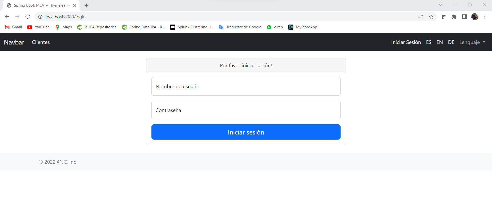
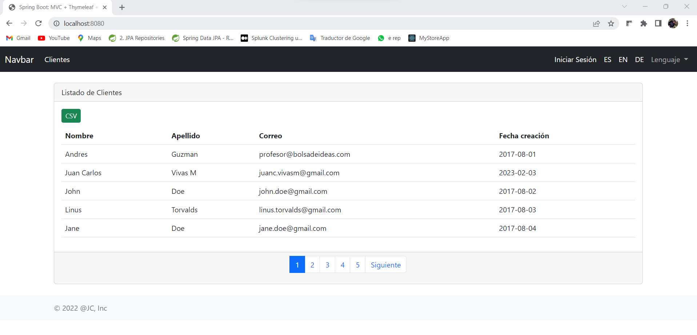

# Aplicación CRUD con Spring MVC, JPA y Seguridad (autenticación y autorización)

Es una aplicación web desarrollada con spring que permite registrar, consultar, modificar y eliminar clientes; así como, 
agregar, eliminar o consultar facturas de un cliente determinado. Estas acciones se realizan según el rol que tiene el 
usuario (administrador, usuario o visitante) al momento de ingresar.

Es importante señalar que el desarrollo es parte del curso: [Spring Framework & Spring Boot desde cero a experto](https://www.udemy.com/course/spring-framework-5/). 
De igual forma, se utilizaron versiones recientes. 

## Preparación del proyecto

- **Clonar el proyecto.** 
- **Base de Datos MySQL:** Se debe crear una base de datos y un usuario con permisos completos.
- **Variables de entorno:** Definir las variables de entorno o reemplazarlas en el archivo `application.properties` para 
    conectarse a la base de datos Ej.:
  - MYSQL_USER=root
  - MYSQL_PASSWORD=12345
  - MYSQL_DB=db_springboot
  - MYSQL_PORT=3306
- **Ejecutar el proyecto:** Ahora que el sitio web está funcionando, visite http://localhost:8080, y debería ver la pagina de inicio.

- **Iniciar sesión:**

| Usuario | Contraseña | Rol            | 
| --- |------------|----------------|
| admin | 12345      | Administrador  |
| jc | 12345      | Usuario        |

